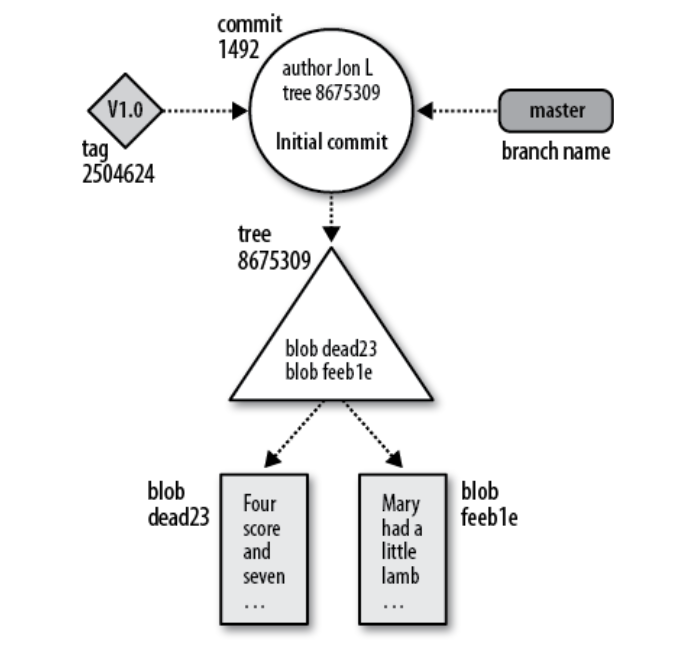
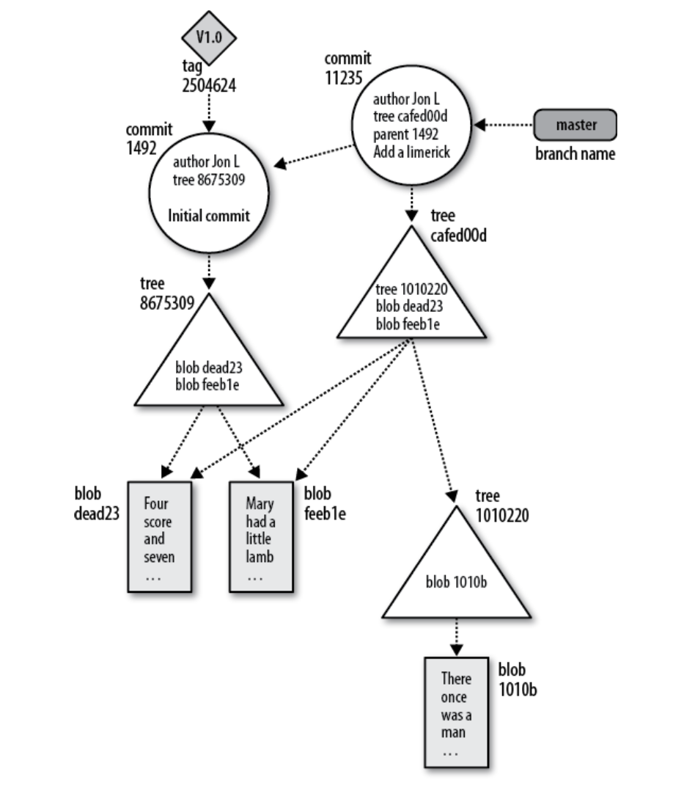

# LEARNING GIT

## Index

1. [Introduction to Git](#ch-1)
2. [Basic Git Concepts (optional chapter)](#ch-2)
3. [File Management and Index](#ch-3)
## Ch-1
> Introduction to git

* `-m` is the shortcut for `--message`

#

* You can change commit default editor with:
```bash
export GIT_EDITOR=editor_name
# such as
export GIT_EDITOR=vim
```

#

* You can add a file and commit using
```bash
git commit (filename.ext) -m "commit message"
```

#

* You can tell git the commit authour by using
```bash
git commit -m "commit message" --author="name <email>"
```

#

* You can see history of commits using:
```bash
git log
```
> This will generate an output like:
```bash
commit 27d883635781888b5bbd60d900865e5174606bd7 (HEAD -> master)
Author: Andrea <andrea@iMac-di-Lineapp.fritz.box>
Date:   Fri Nov 13 14:57:41 2020 +0100

    fix: update learning

commit b83813f0579a66adce47655160be3018e05d68c7
Author: Alessio Marchi <kettei-sproutty@gmail.com>
Date:   Fri Nov 13 14:21:55 2020 +0100

    Initial commit
```

> All the entries are listed from the most recent to the oldest.

#

* You can see more details about a commit using
```bash
git show commitnumber
```

> example

```bash
commit 27d883635781888b5bbd60d900865e5174606bd7 (HEAD -> master)
Author: Andrea <andrea@iMac-di-Lineapp.fritz.box>
Date:   Fri Nov 13 14:57:41 2020 +0100

    fix: update learning

diff --git a/readme.md b/readme.md
index e21e841..8ecff3c 100644
--- a/readme.md
+++ b/readme.md
@@ -1 +1 @@
-# GIT EXAMPLE
\ No newline at end of file
+# LEARNING GIT
\ No newline at end of file
```

> If you run `git show` without a commit number, it shows the details of the most recent commit

#

* You can print a one-line summary of the current branch typing:

```bash
git show-branch branchname
```

> example using `git show-branch master`

```bash
[master] fix: update learning
```

> For more lines you can use `--more=numberoflines` options
```bash
% git show-branch --more=10 master

[master] fix: update learning
[master^] Initial commit
```

#

* You can see differences between to commits using

```bash
git diff commitnumber commitnumbertwo
```

> Example

```bash
git diff 27d883635781888b5bbd60d900865e5174606bd7 b83813f0579a66adce47655160be3018e05d68c7
```

```bash
diff --git a/readme.md b/readme.md
index 8ecff3c..e21e841 100644
--- a/readme.md
+++ b/readme.md
@@ -1 +1 @@
-# LEARNING GIT
\ No newline at end of file
+# GIT EXAMPLE
\ No newline at end of file
```

#

* If you need to remove a file from working tree you can use 

```bash
git rm file.ext
```

> after that you can commit your change

#

* If you need to set global user for future commits you can use

```bash
git config --global user.name "yourname"
git config --global user.email "youremail"
```

> If you need to set different user for a repository, you can use

```bash
git config user.name "yourname"
git config user.email "youremail"
```

#

* If you need to see all git settings you can use

```bash
git config -l
```

> Example

```bash
redential.helper=osxkeychain
core.repositoryformatversion=0
core.filemode=true
core.bare=false
core.logallrefupdates=true
core.ignorecase=true
core.precomposeunicode=true
```

#

* You can edit configuration files using your favorite texteditor 

```bash
nano .git/config
```
> Example

```bash
[core]
        repositoryformatversion = 0
        filemode = true
        bare = false
        logallrefupdates = true
        ignorecase = true
        precomposeunicode = true
[user]
        name = alessio
        email = alessio@lineapp.it
```

#

* You can delete a settings using

```bash
git config --unset user.email #this repository
git config --unset --global user.email #global
```
## Ch-2
### Basic Git Concepts (OPTIONAL)

* **Git Object Types**

Git have something called "object store". It contains original data files and log messages, author information, dates and other informations.

Git have four types of objects:

| Object Type 	| Description                                                   	| Contains                                        	|
|-------------	|---------------------------------------------------------------	|-------------------------------------------------	|
| Blob        	| Rapresented by each version of a file                         	| File data but not metadata                      	|
| Tree        	| Represents one level of directory information.                	| blob identifiers, path names                    	|
| Commit      	| Holds metadata for each change introduced into the repository 	| author, committer, commit date, and log message 	|
| Tag         	| Hhuman readable name to a specific object                     	| Readable Version, such as: version 2.0          	|

For save space over time (when project grows) git compress and stores objects in pack files.

#

* **Index**

Index is a temponary and dynamic binary file that describes the directory structure of the repository

Target is to use "git commands" to **Stage** all changes in the index

> Changes on files that needs **stage** are:
> * Add
> * Delete
> * Edit
> * Create

#

* **Content-Addresable Names**

Each object in the **object store** has an unique name produced applying SHA1 to the contents of the object

> Every change causes the SHA1 has to change

Sometimes during display 160bit hash values are abbreviated to a smallar one.

`example: commits`

#

* **Global Unique Identifiers**

Same files in different directories have exactly the same SHA1.
That means that same code can be compared with SHA1

#

* **Git Tracks Content**

> Git is a *Content Tracking System*

1. Git object store is based on hashed computation of the file
2. Git internal database stores every version of every file (not only the differences).

#

* **Pack files**

Git uses a efficient storage mechanism called a *pack file*.
To create a packed file, git find two files with very similar content and store the content for only one of them.
Then it computes the differences (***delta***) and stores only the differences.

> Packed files are stored in the object store alongside the other objects.

#

* **How Object store works**

> A Triangle rapresents the **blob** object is at the "bottom" of the data structure

> Arrows rapresents **tree** objects points to blobs and possibly to other tress as well.

> A circle reapresents a **commit**, that points to one particular tree

> A Parallelogram rapresents a **tag**, that can point at most at one commit

<div align="center">
    
</div>

> Diagram above shows the state of a repository after a single, initial commit added two files. Both files are in the top-level directory. Both the master branch and a tag named V1.0 point to the commit with ID 1492.

<div align="center">
    
</div>

> This diagram shows the state of the same repository after a single adding a new subdirectory and one file inside of it.

# 

* **Inside .git directory**

If in a new directory you use `git init` for initialize a new git repository, you can list all files using - `find .`

```bash
$ mkdir tmp
$ cd tmp
$ git init

$ find .
.
./.git
./.git/hooks ./.git/hooks/commit-msg.sample ./.git/hooks/applypatch-msg.sample ./.git/hooks/pre-applypatch.sample ./.git/hooks/post-commit.sample ./.git/hooks/pre-rebase.sample ./.git/hooks/post-receive.sample ./.git/hooks/prepare-commit-msg.sample ./.git/hooks/post-update.sample ./.git/hooks/pre-commit.sample ./.git/hooks/update.sample
./.git/refs
./.git/refs/heads
./.git/refs/tags
./.git/config
./.git/objects
./.git/objects/pack ./.git/objects/info
./.git/description
./.git/HEAD
./.git/branches
./.git/info
./.git/info/exclude
```

> Those are all files contained in .git directory (when initialized) and usually you don't have to view or manipulate files inside .git directory (git uses owns commands to do it).

If we create a new object creating a new file and add it to the tree with `git add filename`, the structure will change

```bash
mkdir example
echo "hello world" >> example/hello.txt
#using echo for in-line creating a populate
git add hello.txt
```

we can see using `find .` that object subdirectory will be populate with:

```bash
.git/objects/3b
.git/objects/3b/18e512dba79e4c8300dd08aeb37f8e728b8dad
```

> When git create an object for hello.txt git doesn't care about the filename, but just the content inside of it, calculating its SHA1 hash and enters it into the object store.

#

* **Files and Trees**

Git index is inside `.git/index` and keeps track of file pathnames and blobs.

You can see what index contains using

```bash
git ls-files -s
````

> example with this current project

```bash
$ git ls-files -s

100644 95d09f2b10159347eece71399a7e2e907ea3df4f 0       example/hello.txt
100644 254513149d146ec1a1733cd853558690f40551b5 0       images/ch-2/object-store-1.png
100644 eb4f65c02e9d24bba5d8940cf995e923408d5f6c 0       images/ch-2/object-store-2.png
100644 b9411719fc85c7657b9b6a7e7ae14f94337b6b89 0       readme.md
```

#

* **Saving current index**

You can create a tree with the current index using

```bash
git write-tree
```
It creates a tree object using the current index. The name of the new tree object is printed to standard output.

> Example with the current project

```bash
$ git write-tree
7328a4dabe7b5f23e1057fd19847527b80965539
```

> A tree is an object, just like a blob, so we can use the same command to view it

```bash
$ git cat-file -p 7328a4 #first 6 digits of the sha

040000 tree e8c3bcec01ac3c2ea41249cdfc8c4493d9c29836    example
040000 tree ca354ddaac52afd5aea76db0f2d8bc9703b79c8d    images
100644 blob b9411719fc85c7657b9b6a7e7ae14f94337b6b89    readme.md
```

> Referring the hello.txt file

```bash
$ git cat-file -p e8c3bc

100644 blob 95d09f2b10159347eece71399a7e2e907ea3df4f    hello.txt
```

> The first number (100644) rapresents the file attributes of the object in octal

> The second part (blob) rapresents the object type 

>  The third part (95d09f2b10159347eece71399a7e2e907ea3df4f) is the sha1 hash

> The fourth part (hello.txt) is the file name

It is now easy to see that the tree object has captured the information that was in the index when you ran `git ls-files -s`.

* **Commits**

You can create a commit using low-level command

```bash
echo -n "Commit hello.txt \n" \
| git commit-tree f399deface19ff7fef9396ab6e733db02569b68a

# echo -n "commit message \n" | git commit-tree tree-hash

749850854474a45dd88e76ebee0bfe3ac0a82f8b #output
```

> We can see the result using `git cat-file -p hashoutput`

```bash
$ git cat-file -p 749850854474a45dd88e76ebee0bfe3ac0a82f8b

#output
committer kettei-sproutty <alessio@lineapp.it> 1605533680 +0100

Commit hello.txt 
```

#

* **tags**

There are two king of tag object
1. lightweight
2. annotated

| Type        | Description                  | Permanent |
|-------------|------------------------------|-----------|
| lightweight | Reference to a commit-object |   false   |
| annotated   | Contains a message           |    true   |

You can create an annotated tag using `git tag -m "Tag message" Vversionnumber shorthash(6digit)`

```bash
git tag -m "Tag version 1.0" V1.0 749850
```

> you can see the hash using `git rev-parse version-tag`

```bash
$ git rev-parse V1.0
45cfd2393c37568eeb163588df30d446ddb14500
```

> and print the output using `git cat-file`

```bash
$ git cat-file -p 45cfd23

object 749850854474a45dd88e76ebee0bfe3ac0a82f8b
type commit
tag V1.0
tagger kettei-sproutty <alessio@lineapp.it> 1605534119 +0100

Tag version 1.0
```

> In addition to the log message and author information, the tag refers to the commit object 749850

#

# Ch-3

## File managment and Index

* **What does the index do**

Git's index doesn't container any file content, it just track what you want to commit.

> When you run `git commit`, git checks the index and not working directory.

It's possible to query the index using:

```bash
git status

#output
On branch master
Your branch is up to date with 'origin/master'.

nothing to commit, working tree clean
```

> `git status` prints what git considers staged

# 

* **Git diff**

> `Git diff` displays the change that remain in your working directory and are not staged.

> `git diff --cached` shows the differences that are staged

