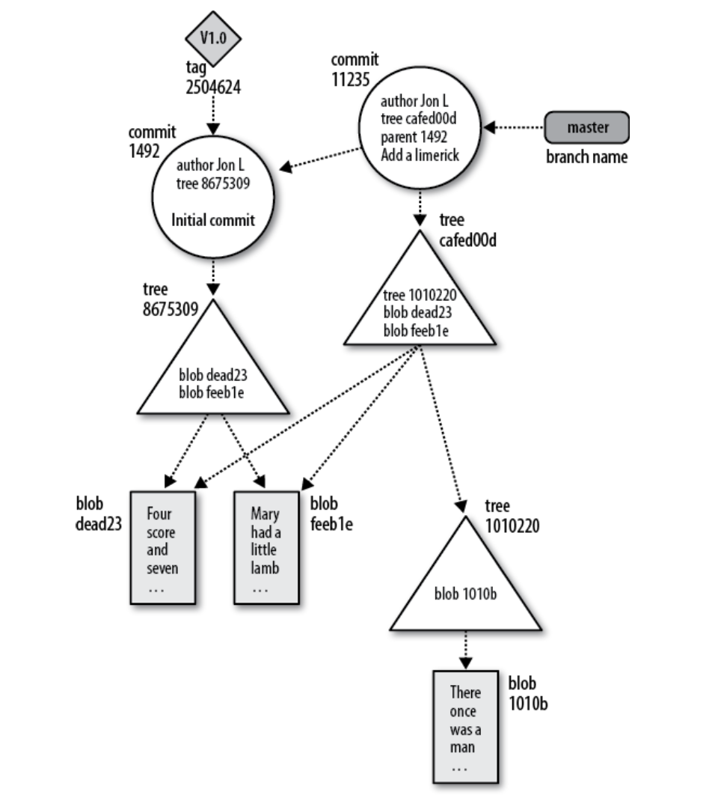

# LEARNING GIT

## Index

1. [Introduction to Git](#ch-1)
2. [Basic Git Concepts](#ch-2)

## Ch-1
> Introduction to git

* `-m` is the shortcut for `--message`

#

* You can change commit default editor with:
```bash
export GIT_EDITOR=editor_name
# such as
export GIT_EDITOR=vim
```

#

* You can add a file and commit using
```bash
git commit (filename.ext) -m "commit message"
```

#

* You can tell git the commit authour by using
```bash
git commit -m "commit message" --author="name <email>"
```

#

* You can see history of commits using:
```bash
git log
```
> This will generate an output like:
```bash
commit 27d883635781888b5bbd60d900865e5174606bd7 (HEAD -> master)
Author: Andrea <andrea@iMac-di-Lineapp.fritz.box>
Date:   Fri Nov 13 14:57:41 2020 +0100

    fix: update learning

commit b83813f0579a66adce47655160be3018e05d68c7
Author: Alessio Marchi <kettei-sproutty@gmail.com>
Date:   Fri Nov 13 14:21:55 2020 +0100

    Initial commit
```

> All the entries are listed from the most recent to the oldest.

#

* You can see more details about a commit using
```bash
git show commitnumber
```

> example

```bash
commit 27d883635781888b5bbd60d900865e5174606bd7 (HEAD -> master)
Author: Andrea <andrea@iMac-di-Lineapp.fritz.box>
Date:   Fri Nov 13 14:57:41 2020 +0100

    fix: update learning

diff --git a/readme.md b/readme.md
index e21e841..8ecff3c 100644
--- a/readme.md
+++ b/readme.md
@@ -1 +1 @@
-# GIT EXAMPLE
\ No newline at end of file
+# LEARNING GIT
\ No newline at end of file
```

> If you run `git show` without a commit number, it shows the details of the most recent commit

#

* You can print a one-line summary of the current branch typing:

```bash
git show-branch branchname
```

> example using `git show-branch master`

```bash
[master] fix: update learning
```

> For more lines you can use `--more=numberoflines` options
```bash
% git show-branch --more=10 master

[master] fix: update learning
[master^] Initial commit
```

#

* You can see differences between to commits using

```bash
git diff commitnumber commitnumbertwo
```

> Example

```bash
git diff 27d883635781888b5bbd60d900865e5174606bd7 b83813f0579a66adce47655160be3018e05d68c7
```

```bash
diff --git a/readme.md b/readme.md
index 8ecff3c..e21e841 100644
--- a/readme.md
+++ b/readme.md
@@ -1 +1 @@
-# LEARNING GIT
\ No newline at end of file
+# GIT EXAMPLE
\ No newline at end of file
```

#

* If you need to remove a file from working tree you can use 

```bash
git rm file.ext
```

> after that you can commit your change

#

* If you need to set global user for future commits you can use

```bash
git config --global user.name "yourname"
git config --global user.email "youremail"
```

> If you need to set different user for a repository, you can use

```bash
git config user.name "yourname"
git config user.email "youremail"
```

#

* If you need to see all git settings you can use

```bash
git config -l
```

> Example

```bash
redential.helper=osxkeychain
core.repositoryformatversion=0
core.filemode=true
core.bare=false
core.logallrefupdates=true
core.ignorecase=true
core.precomposeunicode=true
```

#

* You can edit configuration files using your favorite texteditor 

```bash
nano .git/config
```
> Example

```bash
[core]
        repositoryformatversion = 0
        filemode = true
        bare = false
        logallrefupdates = true
        ignorecase = true
        precomposeunicode = true
[user]
        name = alessio
        email = alessio@lineapp.it
```

#

* You can delete a settings using

```bash
git config --unset user.email #this repository
git config --unset --global user.email #global
```

## Ch-2
### Basic Git Concepts

<div align="center">
    
    
</div>
